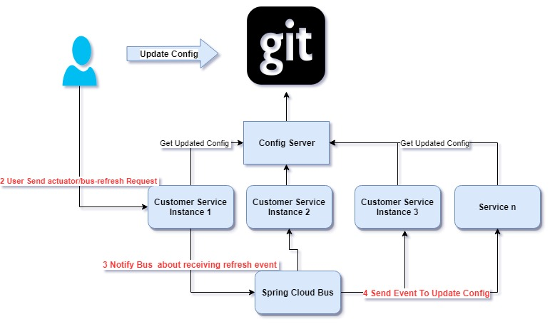

### Spring Cloud Bus

- http://localhost:8080/limits
- http://localhost:8081/limits

#### Actuator refresh can refresh a instance
- POST http://localhost:8080/actuator/refresh 

#### Bus Refresh can refresh all services 
- POST  http://localhost:8080/actuator/bus-refresh

- RabbitMQ docker should start
- 